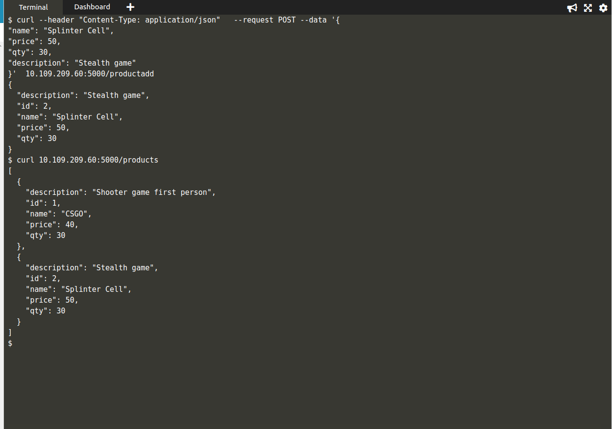
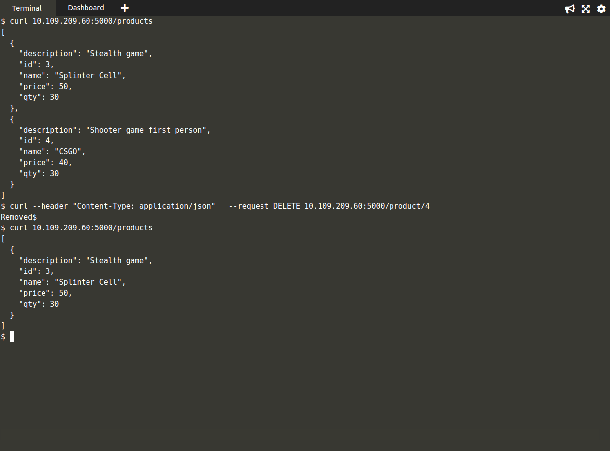

# api


This Project demonstrates how to deploy an API in docker and Kubernetes,

The api has been built using Flask and supported by a mysql database 


## How to run the project

For all the steps 

```sh
- git clone https://github.com/DiptoChakrabarty/api.git

- cd apiapp
```

### Using Python only


```sh
  - Initialize DataBase

  In your terminal
  > python3
  > from apiapp import db
  > db.create_all()
  > exit

  - Run Application API

  python3 app.py

```

###  Using Docker

Dockerfile for flask backend is in current directory

Dockerfile for DataBase is in folder db

```sh

 - To run in background
  docker-compose up -d

 - Run Normally
  docker-compose up

```


### Using Kubernetes

I have run and tested the application in minikube and online kubernetes IDE

```sh
 
 - kubectl apply -f kube

 - Check service Ip of app

    kubectl get svc
 
 - Send requests in the ip provided in the service ip
```


## Send your Requests

You can send request using Postman  or using your terminal like this


- Send Get Request
 This will allow user to see all contents he has entered

```sh
curl 10.109.209.60:5000/products

```


- Send Post Request 

Allows users to add items

```sh

curl --header "Content-Type: application/json"   --request POST --data '{
"name": "CSGO",
"price": 40,
"qty": 30,
"description": "Shooter game first person"
}'  10.109.209.60:5000/productadd

```



- Put Request for a product

Allows user to modify a specific item already entered

```sh
 curl --header "Content-Type: application/json"   --request PUT --data '{
"name": "Splinter Cell Chaos Theory",
"price": 100,
"qty": 3,
"description": "Best Stealth game"
}'  10.109.209.60:5000/product/2

```


- Delete Request

Allows users to remove items

```sh
curl --header "Content-Type: application/json"   --request DELETE 10.109.209.60:5000/product/4

```




## Tech Stack

- Flask
- Flask-SQLAlchemy
- SQL
- Docker
- Docker Compose
- Kubernetes