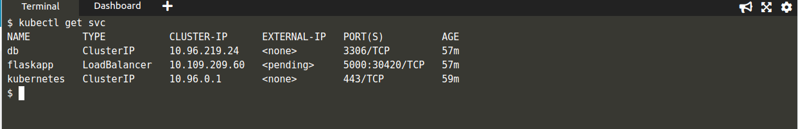

# Flask Kube api  :triangular_flag_on_post:


This Project demonstrates how to deploy an API in docker and Kubernetes,

The api has been built using Flask and supported by a mysql database 


## How to run the project  :information_source:

For all the steps 

```sh
- git clone https://github.com/DiptoChakrabarty/api.git

- cd apiapp
```

### Using Python only :o:


```sh
  - Initialize DataBase

  In your terminal
  > python3
  > from apiapp import db
  > db.create_all()
  > exit

  - Run Application API

  python3 app.py

```

###  Using Docker :whale:

Dockerfile for flask backend is in current directory

Dockerfile for DataBase is in folder db

```sh

 - To run in background
  docker-compose up -d

 - Run Normally
  docker-compose up

```


### Using Kubernetes :boom:

I have run and tested the application in minikube and online kubernetes IDE

```sh
 
 - kubectl apply -f kube

 - Check service Ip of app

    kubectl get svc
 
 - Send requests in the ip provided in the service ip
```



## Send your Requests 	:bomb: 
You can send request using Postman or using your terminal 

## For Routes Documentation visit:
[Postman FlaskKube-API Docs](https://documenter.getpostman.com/view/11026000/TVRdBCDc)


## Routes  :anger:

 | Route | Method | Function | 
 | --- | --- | --- |
 | /productadd | POST | Add data |
 | /products | GET | Show data |
 | /product/id | GET | Show individual items data |
 | /product/id | PUT | Update items data |
 | /product/id  | DELETE| Delete items  |
 | /users | POST | Register User |
 | /auth | POST | Login User |


## Tech Stack :muscle:

- Flask
- Flask-SQLAlchemy
- SQL
- Docker
- Docker Compose
- Kubernetes
